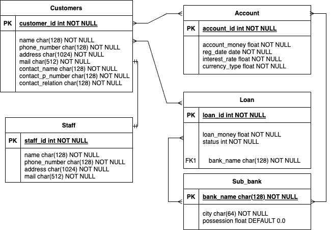

# 银行管理系统 ER 图

如图

实体名分别为 Customers, Account, Staff, Loan, Sub_bank，分别代表客户，账户，员工，贷款，支行

## 客户

| 属性             | 说明           |
| ---------------- | -------------- |
| customer_id      | 客户身份证号   |
| name             | 客户姓名       |
| phone_number     | 客户电话号码   |
| address          | 客户地址       |
| mail             | 客户电子邮件   |
| contact_name     | 联系人姓名     |
| contact_p_number | 联系人电话号码 |
| contact_relation | 联系人关系     |

## 员工

| 属性         | 说明         |
| ------------ | ------------ |
| staff_id     | 员工ID       |
| name         | 员工姓名     |
| phone_number | 员工电话号码 |
| address      | 员工住址     |
| mail         | 员工电子邮件 |

## 账户

| 属性          | 说明     |
| ------------- | -------- |
| account_id    | 账户ID   |
| account_money | 账户余额 |
| reg_date      | 注册日期 |
| interest_rate | 利率     |
| currency_type | 货币类型 |

## 贷款

| 属性       | 说明         |
| ---------- | ------------ |
| loan_id    | 贷款ID       |
| loan_money | 贷款数额     |
| status     | 贷款状态     |
| bank_name  | 贷款支行名称 |

## 支行

| 属性       | 说明         |
| ---------- | ------------ |
| bank_name  | 支行名       |
| city       | 支行所在城市 |
| possession | 支行持有财产 |