# Database Lab 2: Bank Management System

>小组成员：张艺耀 PB20111630 万方 20111645 田东祺 20111644

小组分工：张艺耀：前后端代码实现 万方：部分前端代码实现（LoanManagement BussinessStatistics）田东祺：文件处理和代码运行测试

## ER 图

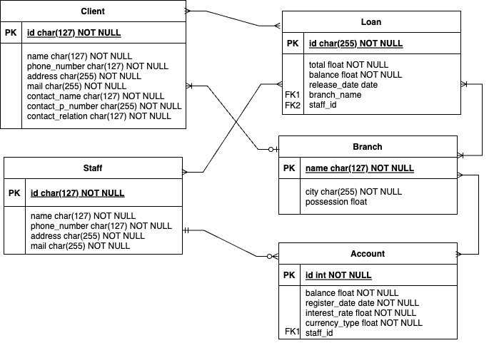

在实现中设计了 Client_Branch 表 Client_Loan表；函数依赖为：(C, B)->A, S->B, (C, S, B)->L 满足 3NF

## 架构设计

B / S 架构，前端使用 Vue3.js + Element Plus，后端使用 Django

### 数据生成与导入

以 account 为例，执行`python gen.py`生成 .csv 文件后执行 `python manage.py runscript insert`批量导入

```python
# gen.py
import faker
import random

class Gen:
    def __init__(self):
        self.fake = faker.Faker(locale='ja_JP')
    
    def account(self, num):
        data = ""

        staffs = ["173-25-1480", "067-84-8258", "141-66-1428", "652-98-0341", "718-98-9270"]

        for _ in range(num):
            id = str(self.fake.unique.random_int(min=100, max=999))
            balance = float(random.randint(0, 1000000))
            register_date = self.fake.date_time_between(start_date='-1y', end_date='now', tzinfo=None)
            interest_rate = 1.02
            currency_type = "JPY"
            staff_id = staffs[random.randint(0, 4)]
            data += f"{id},{balance},{register_date},{interest_rate},{currency_type},{staff_id}\n"
        
        return data
        
if __name__ == "__main__":
    g = Gen()

    data = g.account(15)
    with open("../../data/account.csv", "w") as f:
        f.write(data)
```

```python
# insert.py
import pandas as pd
from api.models import *

def run():
  	# Insert account
    data = pd.read_csv("account.csv", chunksize=15, header=None)
    for items in data:
        for item in items.values:
            obj = Account.objects.filter(id=item[0], balance=item[1], register_date=item[2], interest_rate=item[3], currency_type=item[4], staff_id=item[5])
            if not obj:
                staff = Staff.objects.get(id=item[5])
                o = Account.objects.create(id=item[0], balance=item[1], register_date=item[2], interest_rate=item[3], currency_type=item[4], staff_id=staff)
                o.save()
```

### 前端

#### 用户界面

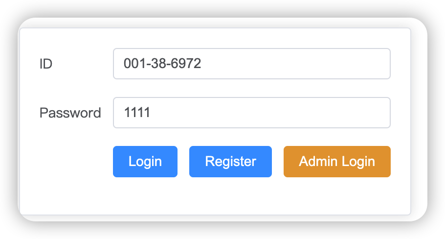


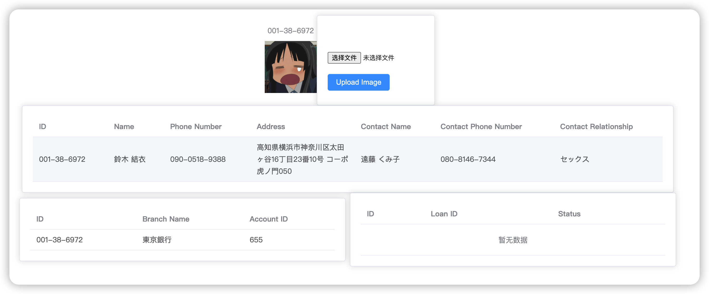

#### 管理员界面

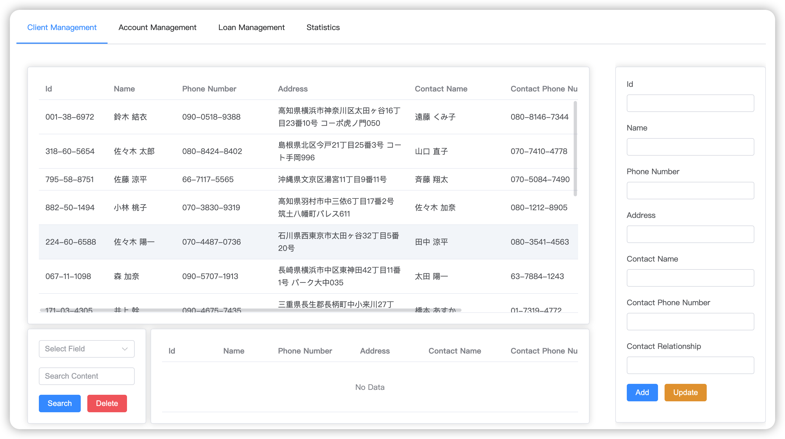

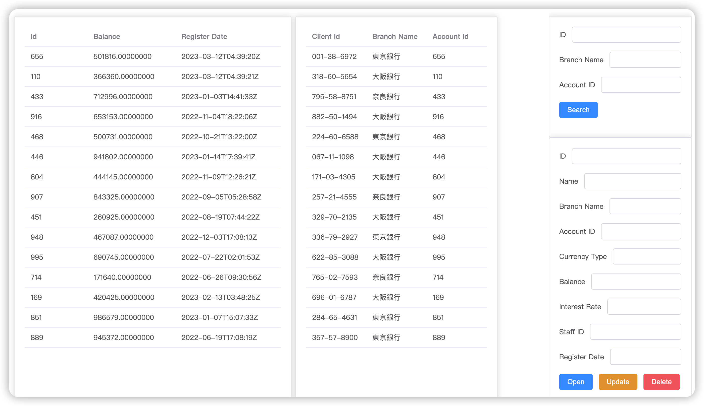

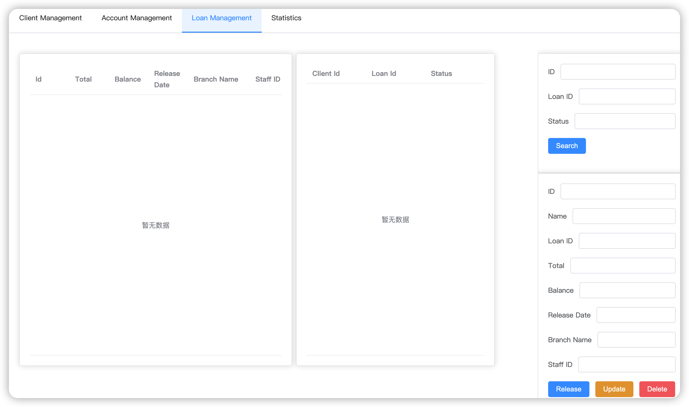

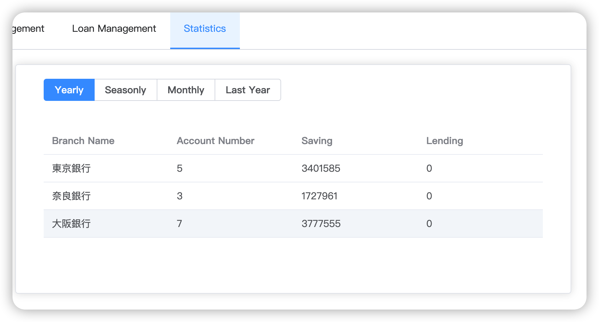

### 后端

### api

管理员接口

#### models.py 

定义了类对应于数据库中的表，变量对应域。

例如 `Client` 类：

```python
class Client(models.Model):
    id = models.CharField(max_length=127, primary_key=True)
    name = models.CharField(max_length=127, null=True, blank=True)
    phone_number = models.CharField(max_length=255, null=True, blank=True)
    address = models.CharField(max_length=255, null=True, blank=True)
    mail = models.CharField(max_length=255, null=True, blank=True)
    contact_name = models.CharField(max_length=127, null=True, blank=True)
    contact_phone_number = models.CharField(max_length=255, null=True, blank=True)
    contact_relationship = models.CharField(max_length=127, null=True, blank=True)
    
    def __str__(self):
        return f"{self.id} {self.name} {self.phone_number} {self.address} {self.mail} {self.contact_name} {self.contact_phone_number} {self.contact_relationship}"
   
```

#### serializers.py

定义了每个模型的`serializer` 序列化程序允许将查询集和模型实例等复杂数据转换为原生 Python 数据类型，然后可以轻松将其呈现为 JSON、XML 或其他内容类型：

```python
ClientSerializer = ClientSerializer()
ClientSerializer.data
# {'id': '001-38-6972', 'name': '鈴木 結衣', ...}
```

#### views.py

定义了每一个接口及接口功能。对于每个模型都建立了 ViewSet ，它默认提供 CRUD 的功能。可以重写这些方法或编写自定义的操作。

例如 `ClientViewSet`视图集，它继承自`rest_framework.viewsets.ModelViewSet`，使用`ClientSerializer`作为序列化器，查询所用的域是`id`：

```python
class ClientViewSet(viewsets.ModelViewSet) :
    queryset = Client.objects.all()
    serializer_class = ClientSerializer
    lookup_field = 'id'
    
     @transaction.atomic
    def destroy(self, request, *args, **kwargs):
        client = self.get_object()

        foo = transaction.savepoint()

        try: 
            client.delete()
        except :
            try:
                client_branch = Client_Branch.objects.get(client_id=client.id)
            except Client_Branch.DoesNotExist:
                transaction.savepoint_rollback(foo)
                return Response(status=status.HTTP_400_BAD_REQUEST, data='Client_Branch does not exist')
            
            client_branch.delete()
            client.delete()
            transaction.savepoint_commit(foo)
            return Response(status=status.HTTP_204_NO_CONTENT)
        
        transaction.savepoint_commit(foo)
        return Response(status=status.HTTP_204_NO_CONTENT)
```

`destory` 函数重写了`delete`方法，这样可以实现先删除外键再删除自身。也可以对可能出现的异常给出相应。

#### urls.py

使用 `ViewSet` 生成默认路由：

```python
from . import views
from rest_framework.routers import DefaultRouter

router = DefaultRouter()
router.register('client', views.ClientViewSet)
router.register('staff', views.StaffViewSet)
router.register('branch', views.BranchViewSet)
router.register('account', views.AccountViewSet)
router.register('loan', views.LoanViewSet)
router.register('client_loan', views.ClientLoanViewSet)
router.register('client_branch', views.ClientBranchViewSet)

app_name = 'api'
urlpatterns = []
urlpatterns += router.urls
```

### register

用户接口

#### models.py

定义了访问用户，除用户名密码域外还支持用户头像的上传：

```python
from django.db import models
from PIL import Image

# Create your models here.

class User(models.Model):
    id = models.CharField(max_length=127, primary_key=True)
    passwd = models.CharField(max_length=127)
    photo = models.ImageField(upload_to='pics', null=True, blank=True)

    def save(self):
        super().save()
        img = Image.open(self.photo.path)
        # resize
        if img.height > 300 or img.width > 300:
            output_size = (300,300)
            img.thumbnail(output_size)
            img.save(self.photo.path)
```

#### views.py

简单的注册登录和上传图片方法，使用`request.FILES.get('image')`得到待上传的图片文件：

```python
from rest_framework import status
from rest_framework import viewsets
from rest_framework.decorators import action
from rest_framework.response import Response

from django.db import transaction

from .serializers import *
# Create your views here.

class UserViewSet(viewsets.ModelViewSet):
    queryset = User.objects.all()
    serializer_class = UserSerializer
    lookup_field = 'id'

    @action(detail=False, methods=['post'])
    @transaction.atomic
    def register(self, request):
        serializer = UserSerializer(data=request.data)
        if serializer.is_valid():
            try:
                with transaction.atomic():
                    user = serializer.save()
                    user.save()
                    return Response(serializer.data, status=status.HTTP_201_CREATED)
            except:
                return Response({'error': 'Username already exists.'}, status=status.HTTP_409_CONFLICT)
        return Response(serializer.errors, status=status.HTTP_400_BAD_REQUEST)
    
    @action(detail=False, methods=['post'])
    def login(self, request):
        id = request.data.get('id')
        passwd = request.data.get('passwd')

        try:
            user = User.objects.get(id=id, passwd=passwd)
        except user.DoesNotExist:
            return Response({'message': 'Invalid credentials'}, status=status.HTTP_401_UNAUTHORIZED)

        return Response(status=status.HTTP_200_OK)
    
    @action(detail=False, methods=['post'])
    def uploadImage(self, request):
        id = request.data.get('id')
        image = request.FILES.get('image')
        user = User.objects.get(id=id)
        user.photo = image
        user.save()
        return Response({'message': 'Image uploaded successfully'}, status=status.HTTP_200_OK)
        
```

## 运行测试

### 用户登录

输入错误密码显示登录错误

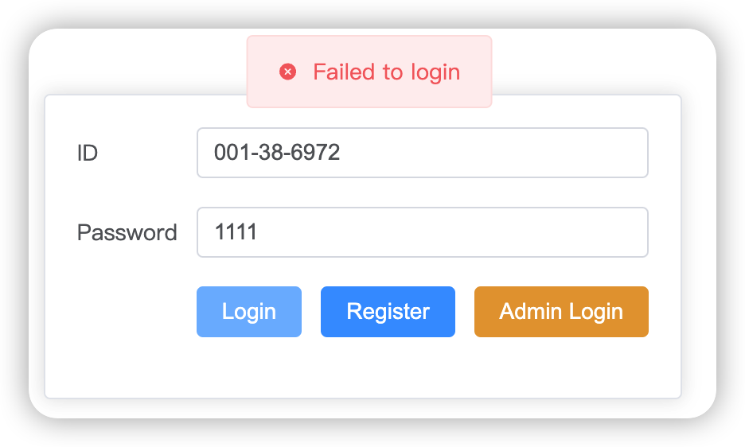

输入正确密码显示登录正确并跳转到用户主页


主页显示有用户个人信息 可以上传图片作为主页图片

### 管理员登录

点击 Admin Login即可跳转到管理员界面


#### CRUD

查询Id = 224-60-6588 的用户，会在查询栏返回查询结果

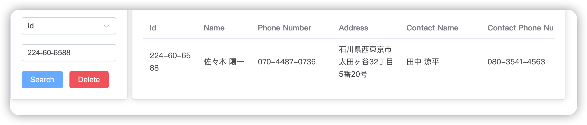

添加一个 Id 为 111 Name 为 222 的用户

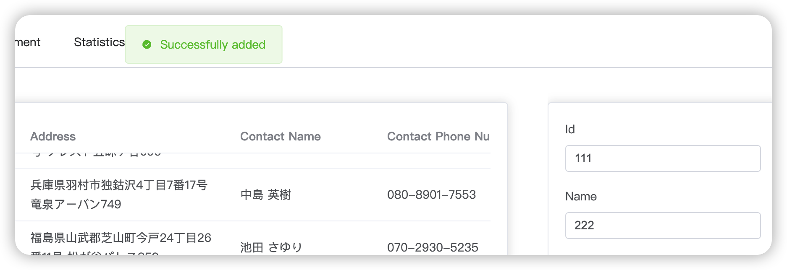

页面刷新后可以看到用户已在列表中

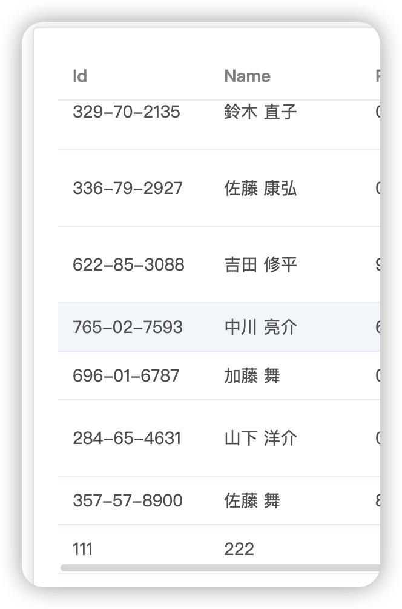

再次添加显示添加错误

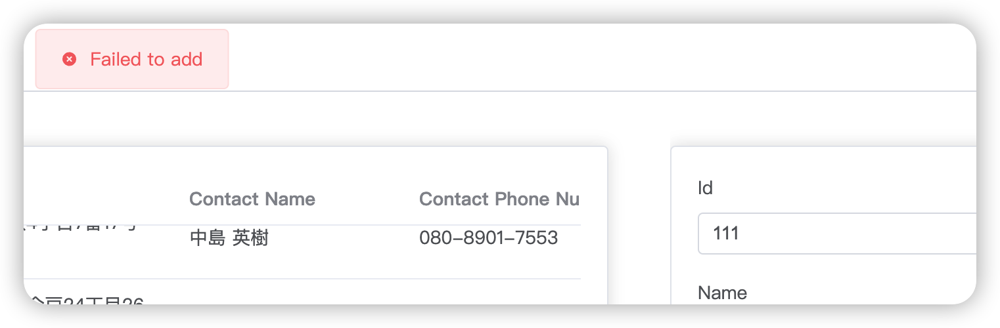

搜索框输入 111，点击删除按钮，删除 Id 为 111 的用户

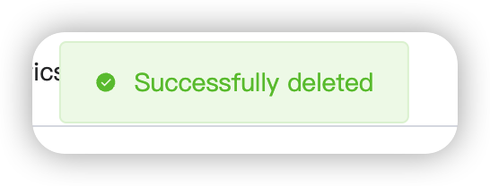

切换到账户管理，更新 Id = 665 账户的利率

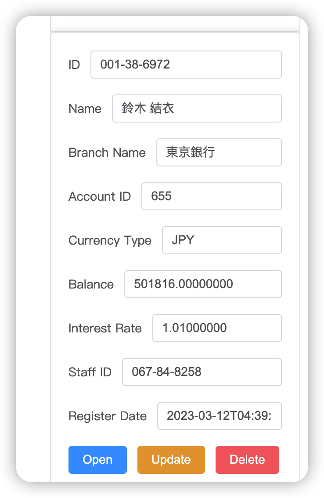

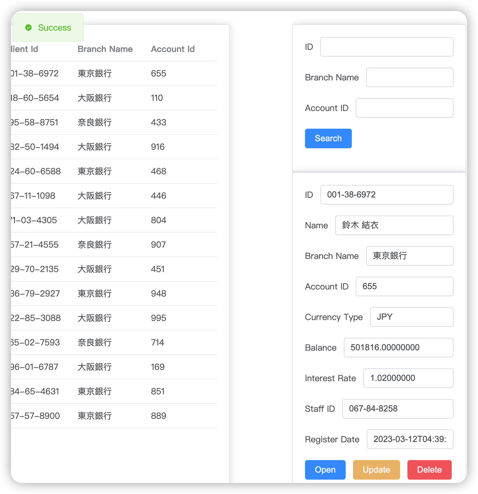

由于 Loan 实现逻辑与 Client 基本一致因此不做展示。

#### 数据统计

可以统计年、季度、月份、上一年的数据


## 不足与展望

由于时间关系还未完成用户界面对后端数据库 CRUD 操作；用户登录注册只实现了最基本的部分，缺少密码强度检查、自动填充、验证码、修改密码等机制；后端没有添加管理员认证（实际上 Django 后端已经给出了写好的 admin 界面，但界面不够优雅且缺少可扩展性）存在安全性问题。
